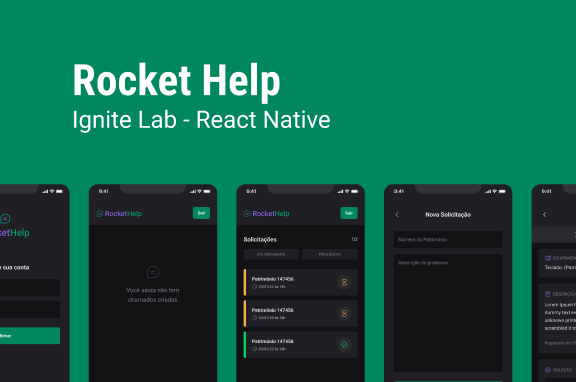

<h1 align="center" style="font-size:3.4rem">:iphone: RocketHelp</h1>

## :movie_camera: Demonstração

https://user-images.githubusercontent.com/73801000/180617079-c10b49d8-a224-4f51-a316-6bb0d6511428.mp4

## :clipboard: Sobre
Projeto realizado no evento feito pela Rocketseat: Ignite Lab React Native. O aplicativo é uma plataforma para solicitações de manutenção de equipamentos internos de uma empresa. Ele tem autenticação e atualização em tempo real, e adicionei uma tela de perfil do usuário.

## :rocket: Tecnologias

- [React Native](https://reactnative.dev/)
- [Typescript](https://www.typescriptlang.org/)
- [Expo Bare Workflow](https://docs.expo.dev/bare/exploring-bare-workflow/)
- [Firebase](https://firebase.google.com/)

### :dizzy: Funcionalidades

- Autenticação por e-mail e senha
- Adição de solicitação de reparo de equipamentos
- Filtro de solicitações finalizadas e em andamento
- Perfil de usuário

---

 

